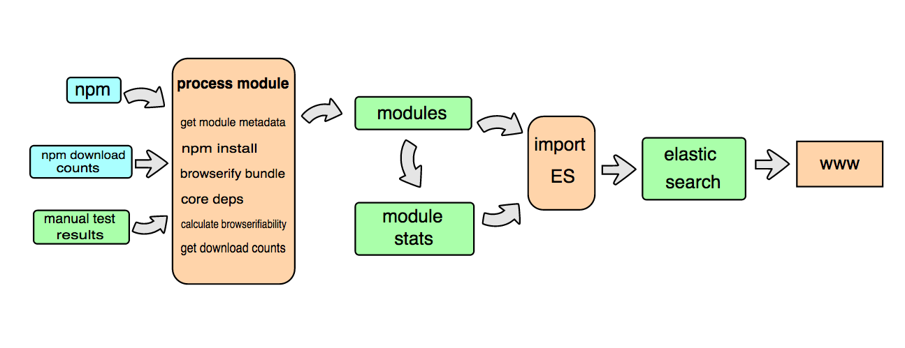

scripts
=======

These scripts run various processes that make browserify search work. This diagram demonstrates at a high level the data flow of the system.



Starting with the first column from the left:

* npm - in general we use the npm registry `registry.npmjs.org` for fetching metadata about modules
* npm download counts - an [API](https://github.com/npm/download-counts) provided by npm Inc.
* manual test results - this is data collected by manually testing 399 randomly selected modules on npm. The data file is [test-summary.json](https://github.com/browserify-search/browserifiability/blob/master/test-summary.json). [Read for more background info](https://gist.github.com/airportyh/56a0dcc0205661024d11).

Second column:

* [process module](https://github.com/browserify-search/process-module) - this is a code module that handles processing an npm module. The code does a number of things, including
  * [get module metadata](https://github.com/browserify-search/process-module/blob/master/npm/get_module_info.js)
  * [npm install](https://github.com/browserify-search/process-module/blob/master/test_module/npm_install.js)
  * [browserify bundle](https://github.com/browserify-search/process-module/blob/master/test_module/browserify_bundle.js)
  * get [core deps](https://github.com/browserify-search/core-deps) - get the core node modules a module depends on.
  * [calculate browserifiability](https://github.com/browserify-search/browserifiability) - which represents the probability that an npm module will work with browserify.
  * [get download counts](https://github.com/browserify-search/process-module/blob/master/get_download_count.js)

Third column:

* `modules` - this is a mongodb collection contain one document per module, storing the data gotten from [process-module](https://github.com/browserify-search/process-module)
* `moduleStats` - this is a mongodb collection storing the mean, and variance for the download counts throughout the entire npm registry, calculated via a map reduce command in [aggregate_stats.js](https://github.com/browserify-search/scripts/blob/master/aggregate_stats.js).

Fourth column:

* import ES - this is a [script](https://github.com/browserify-search/scripts/blob/master/bulk_insert_elasticsearch_from_db.js) that takes `modules` and `moduleStats` from the mongodb as input and exports the data into Elastic Search.

Fifth column:

* the elastic search instance provides full text search capability to the search engine

Sixth column:

* [www](https://github.com/browserify-search/www) - implements the module search engine website

## The Scripts

### Processing Modules

* `./follower.js` - this script runs continuously in the background of the web server, tracking changes in the main npm registry using [follow-registry](https://www.npmjs.org/package/follow-registry). As soon as a module is published, in runs `process-module` to process it.
* `./dispatcher.js` and `worker.js` - this pair of scripts enable distributed parallel processing of npm modules. `dispatcher.js` will be started from the web server (with the mongodb instance), while `worker.js` will be started on any number of worker machines. The communicate via zero mq and all results will be saved to the mongodb instance.

### Elastic Search

### Configuration

First things first, you need to [install elastic search](http://www.elasticsearch.org/). Then you need to make sure you have the following settings in `elasticsearch.yml` (usually in the `config` directory within the location where Elastic Search is installed):

```
http.max_content_length: 1000mb
script.disable_dynamic: false
```

### Updating Elastic Search

* `update_mapping` - this drops the data collection on elastic search (starts over) and updates the schema. You can tweak the schema prior to running if you want to tweak the search parameters to weight certain fields more than others.
* `bulk_insert_elasticsearch_from_db.js` - this script reads from the `modules` and `moduleStats` collections in mongodb and streams a stream of line-separated json output suitable for bulk inserting into elastic search. To actually do this, you can use the command
        ```
        ./bulk_insert_elasticsearch_from_db.js | curl -s -XPOST localhost:9200/browserify-search/module/_bulk --data-binary @-
        ```
* `bulk_insert_elasticsearch_from_files.js` - instead of reading from mongodb, you can instead read from a mongodb data dump with this script. Get the [data dump files](https://www.dropbox.com/sh/5cqeb8xj4z35w6l/AAAp5QSiQT00b_KergLyowkma?dl=0), then run 
        ```
        ./bulk_insert_elasticsearch_from_files.js modules.json moduleStats.json
        ```

## Update Download Counts

* `update_download_counts.js all` - updates the download counts for every module in mongodb.

